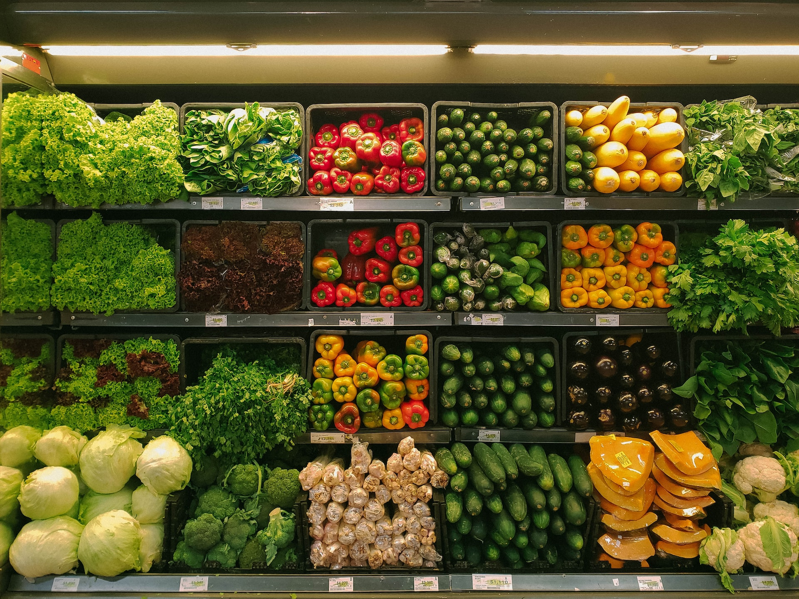
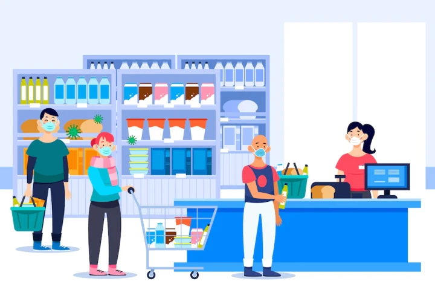

# Supermarket Sales Analysis Case Study

## Goal

To create visualizations based on a supermarket dataset to suggest how the store can maximize profits and reduce losses.
Dataset 

The dataset I used is available on <a href="https://www.kaggle.com/datasets/bravehart101/sample-supermarket-dataset">Kaggle</a>. It has information about the store’s profits, sales, locations, and products. 

## Questions

<ul>
    <li>What are the trends in profit, loss, and sales of the superstore?</li>
    <li>How do they differ among different states and cities?</li>
    <li>Do discounts help the store make more profit or only make customers happy?</li>
</ul>

## Overview

The variables of interest are profit, sales, discount, quantity, and location. Here is a quick summary:

<code> summary(select_if(dt, is.numeric))   
Sales                Quantity        Discount           Profit           
Min.   :    0.444    Min.   : 1.00    Min.   :0.0000    Min.   :-6599.978    
1st Qu.:   17.280    1st Qu.: 2.00    1st Qu.:0.0000    1st Qu.:    1.729    
Median :   54.490    Median : 3.00    Median :0.2000    Median :    8.666    
Mean   :  229.858    Mean   : 3.79    Mean   :0.1562    Mean   :   28.657    
3rd Qu.:  209.940    3rd Qu.: 5.00    3rd Qu.:0.2000    3rd Qu.:   29.364    
Max.   :22638.480    Max.   :14.00    Max.   :0.8000    Max.   : 8399.976 </code>

<ul>
   <li> The store makes $230 average sales of  with an average of $28 profit. </li>
  <li> Minimum 1 product is bought from the store per visit and it can go as high as 14 with an average of 4 products. </li>
   <li> The store has offered an average of 16% discount on its products with the highest being 80%. </li>
  <li> While the highest profit is $8,400, the store also suffered losses as sharp as $6,600 which are likely from the products on hefty discounts. </li>
</ul>
