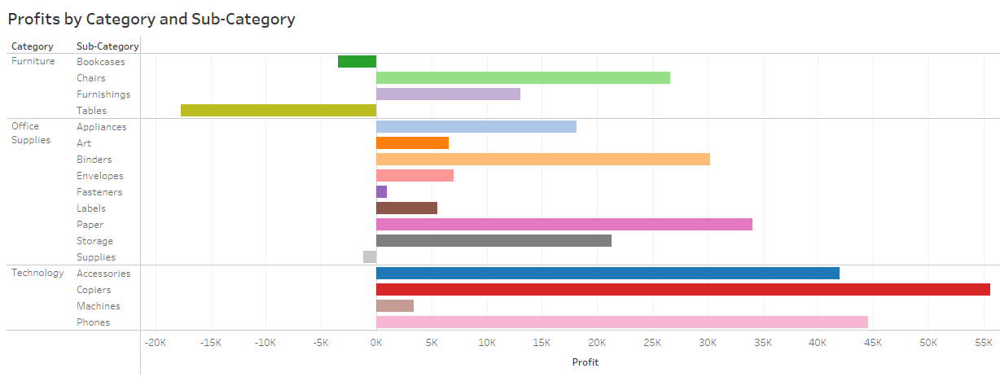
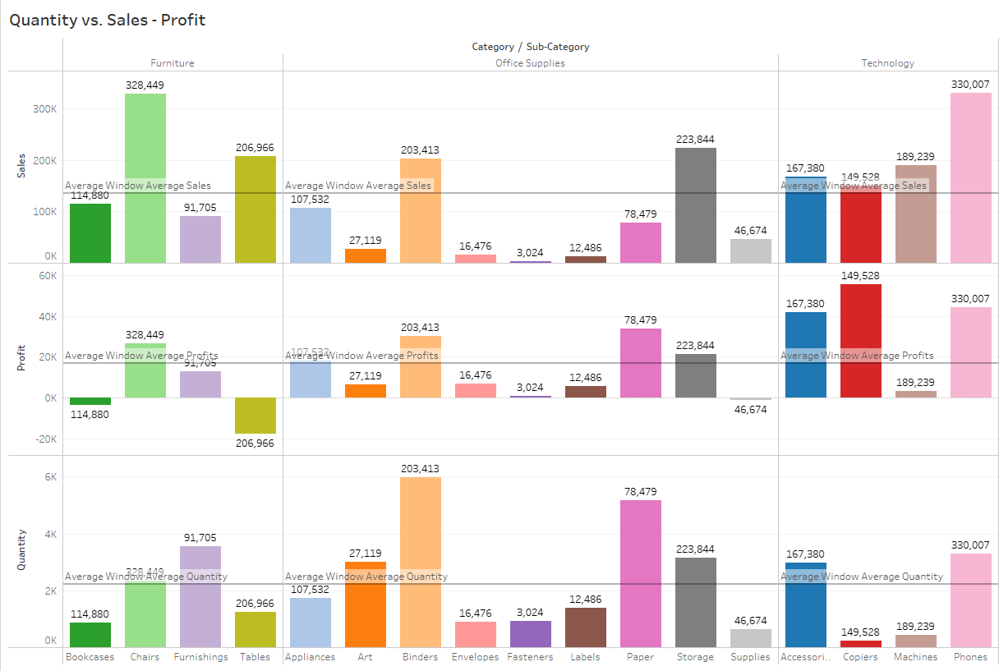
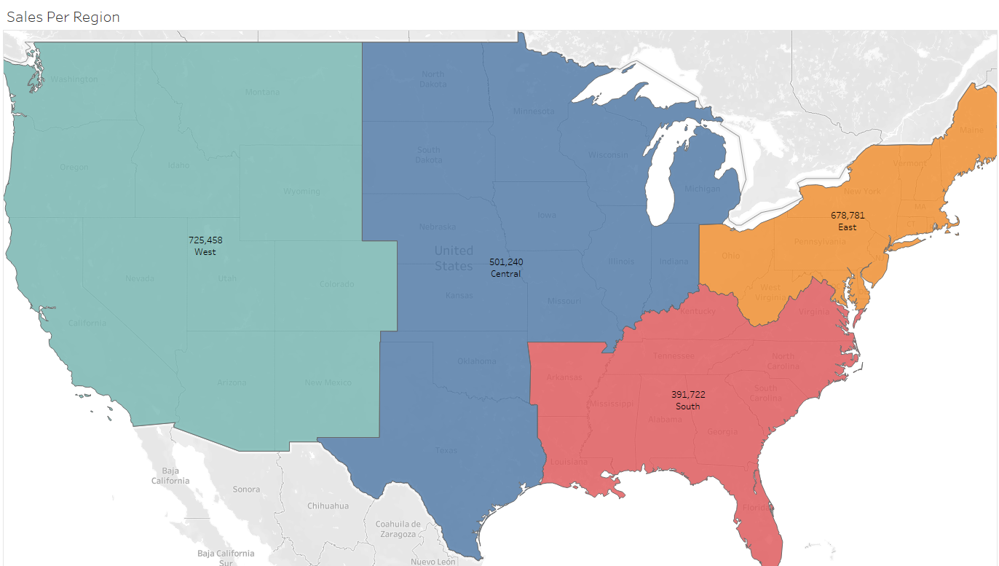

# Supermarket Sales Analysis Case Study

## Goal

To create visualizations based on a supermarket dataset to suggest how the store can maximize profits and reduce losses.
Dataset 

The dataset I used is available on <a href="https://www.kaggle.com/datasets/bravehart101/sample-supermarket-dataset">Kaggle</a>. It has information about the store’s profits, sales, locations, and products. 

## Questions

<ul>
    <li>What are the trends in profit, loss, and sales of the superstore?</li>
    <li>How do they differ among different states and cities?</li>
    <li>Do discounts help the store make more profit or only make customers happy?</li>
</ul>

## Overview

The variables of interest are profit, sales, discount, quantity, and location. Here is a quick summary:

<code> summary(select_if(dt, is.numeric))   
Sales                Quantity        Discount           Profit           
Min.   :    0.444    Min.   : 1.00    Min.   :0.0000    Min.   :-6599.978    
1st Qu.:   17.280    1st Qu.: 2.00    1st Qu.:0.0000    1st Qu.:    1.729    
Median :   54.490    Median : 3.00    Median :0.2000    Median :    8.666    
Mean   :  229.858    Mean   : 3.79    Mean   :0.1562    Mean   :   28.657    
3rd Qu.:  209.940    3rd Qu.: 5.00    3rd Qu.:0.2000    3rd Qu.:   29.364    
Max.   :22638.480    Max.   :14.00    Max.   :0.8000    Max.   : 8399.976 </code>

<ul>
  <li> The store makes $230 average sales of  with an average of $28 profit. </li>
  <li> Minimum 1 product is bought from the store per visit and it can go as high as 14 with an average of 4 products. </li>
  <li> The store has offered an average of 16% discount on its products with the highest being 80%. </li>
  <li> While the highest profit is $8,400, the store also suffered losses as sharp as $6,600 which are likely from the products on hefty discounts. </li>
</ul>

## Part I: Profit / Loss by Category

Let's see how the store makes profit, i.e., which product categories contribute to its profit and / or loss.

 <ul>
  <li> Chairs, paper, and copiers in categories furniture, office supplies, and technology, respectively, have made the maximum profits. </li>
  <li> Tables, bookcases from furniture category and supplies from office supplies category account for the store's overall loss. </li>
 </ul> 

If the selling price of a product is higher than the average cost of production for a certain quantity, then the store should earn profits, provided the entire quantity produced is sold. If not, it can incur loss

In this store’s case, which is it - less quantity sold or selling price presumably less than avg. production cost? Let's take a closer look at products which caused loss - tables, bookcases, supplies.

 <ul>
  <li> The quantity of bookcases sold is the lowest followed by tables, in the furniture category. The same follows for supplies in office supplies category. </li>
  <li> While the total no. of units produced is not given in the dataset, the quantity sold for all the three subcategories is less than its category average. It is possible that the entire quantity produced was not sold. </li>
 </ul>

## Part II: Profit / Loss by Location

Let's see which region, states, and cities generate more sales and profit and which cities contribute to loss. 

Region

<ul>
  <li> Highest sales is observed in the west region, followed by east, central, and south regions. </li>
</ul>  

State

Let's have a look at the sales and profit in terms of states.
